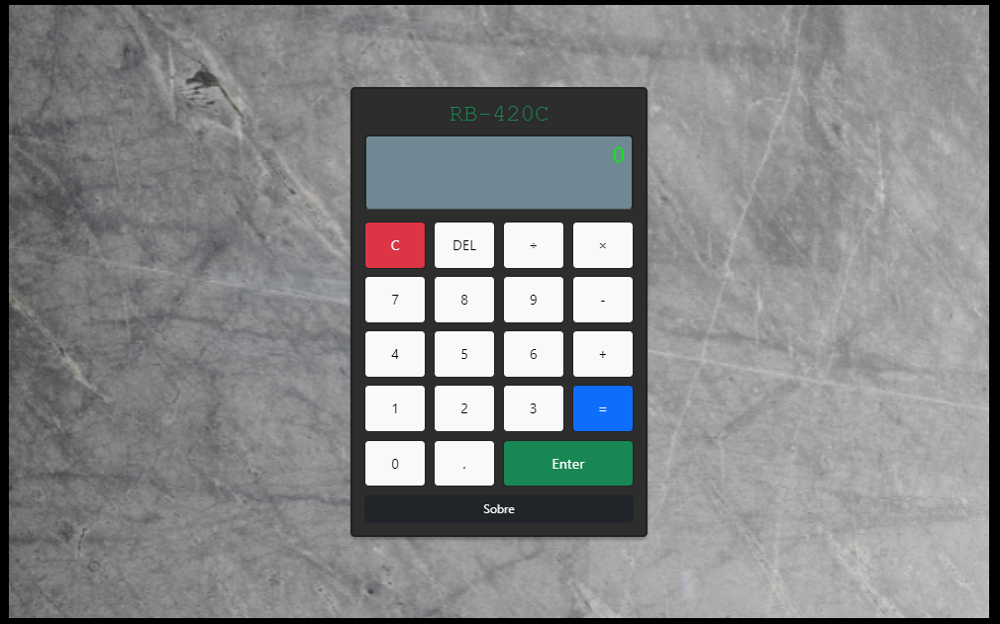

# RB-420C: Calculadora



## Descrição

A **RB-420C** é uma calculadora simples desenvolvida com **Vue.js** e **Vite**, que simula o funcionamento de uma calculadora tradicional com operações básicas de adição, subtração, multiplicação e divisão. A calculadora possui um display digital estilizado e um layout intuitivo para uma experiência agradável.

## Funcionalidades

- **Operações Básicas**: Suporte para adição, subtração, multiplicação e divisão.
- **Entrada Limitada**: Limite de 16 caracteres no visor da equação.
- **Correção de Erros**: Botão "DEL" para remover o último caractere digitado.
- **Cálculo Automático**: Usa a função `eval()` para calcular a equação.
- **Armazenamento do Resultado**: O botão "Enter" permite armazenar o resultado e reutilizá-lo em novos cálculos.
- **Reset Completo**: Botão "C" para limpar a equação e o resultado.
- **Link Externo**: Botão "Sobre" que redireciona para o repositório no GitHub.

## Layout da Calculadora

O layout inclui um **display** que exibe a equação e o resultado, com uma grade de botões organizados em 4 colunas para uma interação simples e intuitiva.


## Pré-requisitos

Antes de começar, certifique-se de ter os seguintes requisitos instalados:

- **Node.js** (versão recomendada 14.x ou superior)
- Gerenciador de pacotes **npm** ou **yarn**
- **Vite** para execução do ambiente de desenvolvimento.

## Como Instalar e Executar o Projeto

1. Clone o repositório:

   ```bash
   git clone https://github.com/Biasiolo/calculadora_2_0
   ```

2. Acesse o diretório do projeto:

   ```bash
   cd calculadora_2_0
   ```

3. Instale as dependências:

   ```bash
   npm install
   ```

4. Inicie o servidor de desenvolvimento com Vite:

   ```bash
   npm run dev
   ```

5. Abra o navegador e acesse:

   ```bash
   http://localhost:5173
   ```

## Scripts Disponíveis

No arquivo `package.json`, você encontrará os seguintes scripts:

- `npm run dev`: Inicia o servidor de desenvolvimento usando Vite.
- `npm run build`: Compila o projeto para produção.
- `npm run preview`: Visualiza a versão de produção compilada.

## Tecnologias Utilizadas

- **Vue.js**: Framework JavaScript para construção de interfaces de usuário.
- **Vite**: Ferramenta de build rápida para desenvolvimento de projetos front-end.
- **Bootstrap**: Framework CSS para layout responsivo e design visual.
- **CSS**: Para personalização e estilização do layout da calculadora.

## Customização

Para customizar a calculadora ou adicionar funcionalidades, modifique os arquivos em:

- `src/components/`: Para alterar os componentes de interface.
- `src/assets/images/`: Para alterar as imagens usadas no background da aplicação.
- `src/styles.css`: Para ajustes de estilo e aparência.

## Contribuindo

Contribuições são bem-vindas! Para contribuir, siga estas etapas:

1. Faça um **fork** do projeto.
2. Crie um branch para sua nova funcionalidade:
   ```bash
   git checkout -b feature/nova-funcionalidade
   ```
3. **Commit** suas alterações:
   ```bash
   git commit -m 'Adiciona nova funcionalidade'
   ```
4. Envie para o branch remoto:
   ```bash
   git push origin feature/nova-funcionalidade
   ```
5. Crie uma **Pull Request** no repositório original.

## Autor

- [Biasiolo](https://github.com/Biasiolo)

## Licença

Este projeto está licenciado sob a licença MIT.

---

Este **README** agora reflete o uso do Vite no ambiente de desenvolvimento, bem como as instruções ajustadas para instalação e execução.
